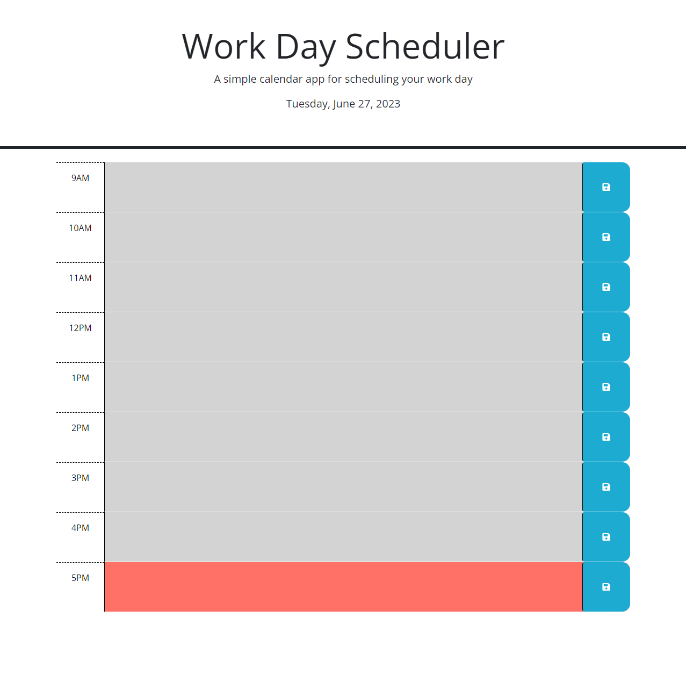

# Work Day Scheduler Week 5 Challenge

## Link:

https://edmond-su.github.io/Day-Scheduler-Week-5-Challenge/

## Description

This project was to create a webpage scheduler for the average work day (9am - 5pm). This project allows the user to add appointments to each hour of the work day and save them locally. Time blocks that have past will have a grey background, time blocks for the future will have a green background and the time block for the current hour will have a red background. Upon refreshing the webpage it will change the background colors of each hourly time block to reflect the current time and it will also keep all saved appointments in their correct time blocks. This project has allowed to gain a better understanding of using jQuery and Day.js.

## Installation

N/A

## Usage

To add and save an appointment, click on the central text area for the time block that the appointment is at. Enter the details of the appointment and then click on the blue save button on the right of the time block you added the appointment to. Some text will appear below the header to notify the user that the appointment has been saved. Refresh the page to allow the page to update the background colors of the timeblocks.

## Credits

N/A

## License

N/A